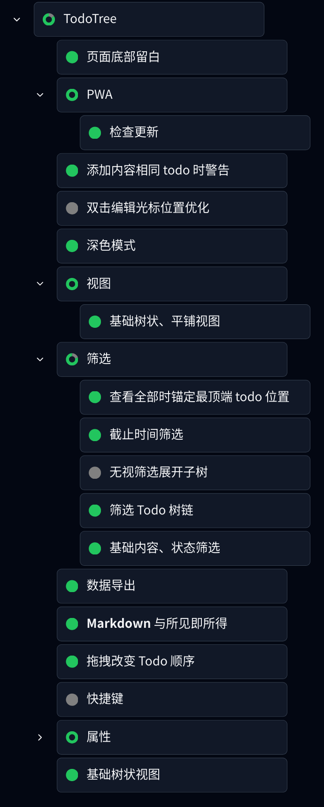

# TodoTree

一个树形 Todo 管理 Web 应用。

## TodoTree of TodoTree

以下是 TodoTree 的 TodoTree 截图（按照项目进度更新）：



## 参与本项目

### 建议反馈

欢迎通过 [Issue](https://github.com/ForkKILLET/TodoTree/issues) 提交建议或是反馈问题。

### 参与开发

欢迎参与本项目的开发，流程如下：

```bash
# 克隆项目
pnpm install # 安装依赖
cd packages/frontend # 进入前端项目目录
pnpm dev # 启动开发服务器
pnpm build # 构建
pnpm lint:fix # 运行 ESLint
# 提交 PR
```

## 说明

- 目前，TodoTree 是一个纯网页应用，数据保存在浏览器 IndexDB 中，虽然刷新页面、重启浏览器也不会丢失数据，但请您使用时也注意数据安全。

- 本项目的大部分代码是 AI 生成，没有经过严谨的 review，因而对代码质量不做任何保证。